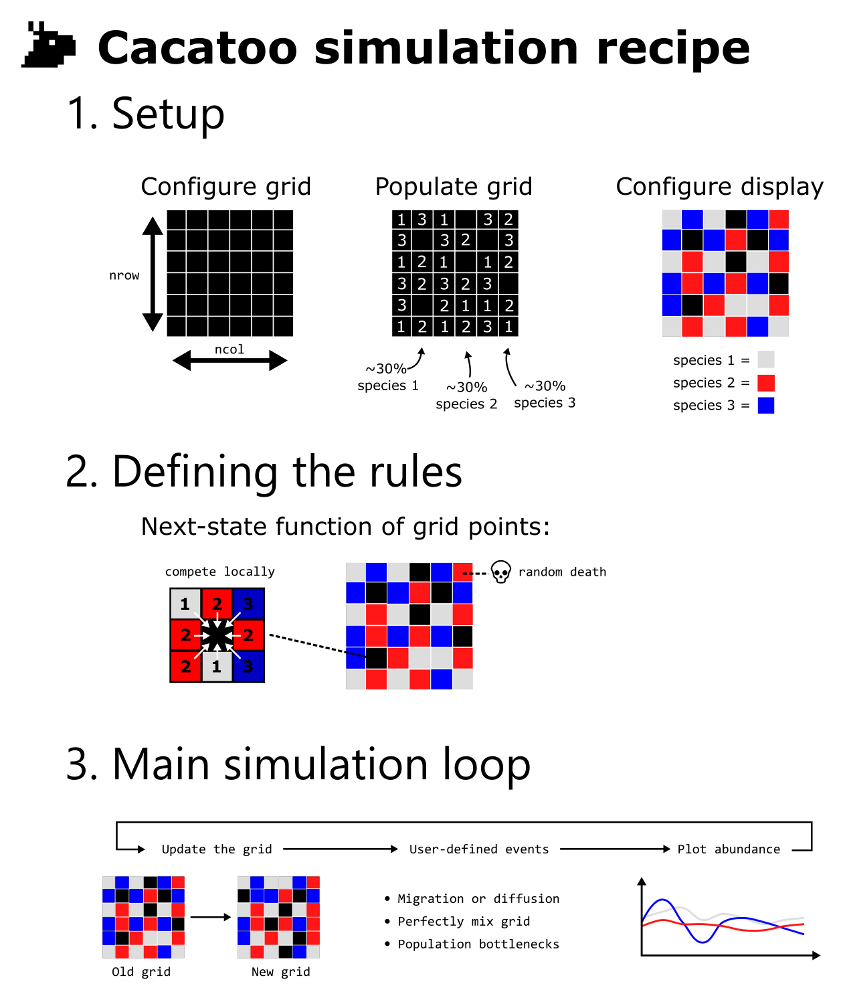

# Cacatoo

Cacatoo is a toolbox for modelling and exploration of spatially structured simulations. Because it is written in 100% javascript it requires no installation and works on any machine, making building, sharing, and exploring your model easier than it ever was! With a web-based interface that is ideal for students to learn how to program, and a NodeJS-mode which allows one to rapidly run simulations directly from the command line, it is suited for beginners and advanced programmers alike!

## Getting started

You don't need to install anything. You can either immediately start playing with one of the many [JSFiddle examples](https://bramvandijk88.github.io/cacatoo/examples_jsfiddle.html), or dowload this repository and explore dozens of more examples! 
If you want help with Javascript, I recommend [this](https://youtu.be/W6NZfCO5SIk) tutorial from "Programming with Mosh". The first hour is free, and the other 6 hours are definitely worth the money. I also recommend setting up a nice coding environment, as I explain in [this blog post](https://www.bramvandijk.com/blog/2020/11/20/javascript-programming-part-ii-my-setup).

## How to Cacatoo
If you prefer to learn by example, I have made dozens of different models for you to start playing (found in the "examples" folder of the repository), ranging from beginner to expert! That said, Cacatoo has been extenstively documented. Tutorials and overviews of its many functions can be found [here](https://bramvandijk88.github.io/cacatoo). Briefly, setting up a Cacatoo model consists of roughly three steps: 1) setup, 2) defining the rules, and 3) setting up a main simulation loop (see image below). I have added comments to some of the example files, denoting which step is to be executed where in the code. If you want to get in debt on what each function specifically does, check out the [JSDocs](https://bramvandijk88.github.io/cacatoo/jsdocs/index.html).

  

# Motivation

Complex systems like microbial communities, the human immune system, and the Earth's climate, have many emergent properties which arise from the interactions between individual components. As such, predicting exactly how these systems will behave and respond to various stimuli is difficult. Simulation offers a solution by allowing a modeller to simply put in what they deem important, and observe the outcome. As such, direct visual feedback is an important part of the process of "getting to know" your model. Not only are you more likely to detect programming mistakes, but it also aids exploration of parameter space. Over the last decade, most of my models were implemented by using the CASH C-library, which would allow direct visual feedback by means of the X11 library (R.J. de Boer & A.D. Staritsk). However, as it is based in C, developing models with CASH requires a lot of programming experience, and even an experienced user like myself can sometimes take days to track down a simple bug. Moreover, sharing your model with other users can be a pain in the neck, as installation is slightly different depending on the operating system. The amazing toolbox [Artistoo](https://artistoo.net/) has illustrated how Javascript can be both beginner-friendly and versatile. Hence, I decided that Javascript was the way forward!   

# FAQ

**Q**: My model isn't running, what can I do to find out what's wrong?\
**A**: Open the developer console (CTRL+SHIFT+I in Google Chrome), and see which line of your code causes the problem. If it is an error in Cacatoo, please submit an issue on the Github repository.    

**Q**: Grid points / individuals are dissappearing every update!\
**A**: By far the most common reason for this is the synchronous updating of the grid. When synchronously updating the grid,
make sure only the focal cell is modified by the nextState function. If not, the order of updating may cause individuals to appear / dissapear. If you want the nextState to be able to modify neighbouring grid points, only use *asynchronous* updating (see examples).   

**Q**: My model is too slow, how do I find what is slowing things down?\
**A**: Open the developer console (CTRL+SHIFT+I in Google Chrome), and go to the 'profile' tab. You can run the code for a bit and observe which functions are taking most time. As a general rule, try and avoid build-in functions of javascript (e.g. 'reduce' to get the sum of an array), because despite being easier to use, they are quite a bit slower than a C-style piece of code where you loop over the values yourself. After you understand the model, and you simply want to rapidly run many simulations, I recommend running the code from the command line with nodeJS (also see the "cheater" example).     
**Q**: Why is this toolbox called Cacatoo?\
**A**: Cacatoo is an acronym for CAsh-like Cellular Automaton TOOlbox. However, as Cacatoo developed it became much more than just a tool for cellular automata. The name stuck, however.   

# Contributing to Cacatoo

As the sole developer of Cacatoo, I am eager to get help, suggestions, or use cases from others. For organisational reasons, I encourage everyone to always submit an official Github issue, and be sure to include the following details:

## Reporting bugs

When describing a bug, make sure to:
* Describe the unexpected behaviour
* Describe the desired behaviour
* Include a reproducable example

## Suggesting additions

When making suggestions, make sure to:
* Describe the missing feature
* Describe or sketch the expected output

## Pull requests

When you want to actively contribute to Cacatoo, you can suggest to become a collaborator on Github.
Implemented new branches may be merged with the main branch if the changes are expected to be useful to other. 

* Please give an extensive description of what your branch adds to Cacatoo
* Please run the default unit test (see below) and add the output to the pull request. 
* (optional, but appreciated) Please add a branch-specific unit test for your branch to the unit_test directory

## Mocha unit testing 

If you want to test your code, or want to issue a pull request, please use Mocha to run the tests provided in the directory unit_test:

* Install mocha (npm install mocha)
* E.g. run the default tests (./node_modules/mocha/bin/mocha unit_test/)

## Submitting JS fiddle examples. 

If you made a nice Cacatoo model which you would like to see on the [JS fiddle examples page](https://bramvandijk88.github.io/cacatoo/examples_jsfiddle.html), be sure to:
* Make sure your code works as intended in JS fiddle (should not require any rewriting, just some copy-pasting)
* Give a title and description of your model 
* Give your name so I can credit you

## Other useful developer commands

The bundle was made with rollup:
> rollup src/model.js -o dist/cacatoo.js -f cjs  -w

Documentation was compiled with jsdoc (npm install jsdoc -g)
> jsdoc dist/cacatoo.js -d docs/jsdocs

Unit testing is done with Mocha (npm install mocha)
> mocha unit_test/ 

## License
This library is free software; you can redistribute it and/or modify it under the terms of the GNU General Public License, version 3, as published by the Free Software Foundation. 

This program is distributed in the hope that it will be useful, but without any warranty; without even the implied warranty of merchantability or fitness for a particular purpose. See the GNU General Public License for more details.

