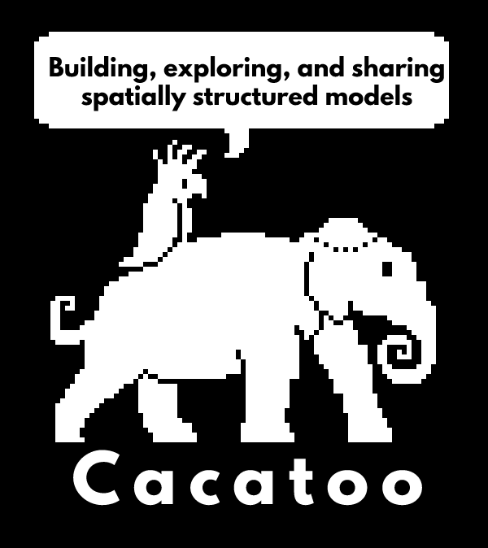

# Cacatoo

Cacatoo is a highly customisable toolkit that makes building spatially structured models of biology easy. Because it is written in 100% javascript it requires no installation and works on any machine, making building, sharing, and exploring your model easier than it ever was! With a web-based interface that is ideal for students to learn how to program, and a NodeJS-mode which allows one to run directly from the command line, it is suited for beginners and advanced programmers alike! 

## Getting started

You don't need to install anything, just dowload this repository and start playing!
If you want help with Javascript / setting up a nice coding environment, check out this [blog post](https://www.bramvandijk.com/blog/2020/11/20/javascript-programming-part-ii-my-setup).
For Cacatoo-specific help, start by taking a look at the examples folder. This folder contains simple HTML files you can open with your browser (Chrome is recommended). Two examples (gol and cheater) have been extensively commented to explain how Cacatoo works.

## What else can I do?
For an overview of all the Classes and functions you can use in Cacatoo, [see here](https://bramvandijk88.github.io/cacatoo/Simulation.html)

## Notes for developers

The bundle was made with rollup:
> rollup src/model.js -o dist/cacatoo.js -f cjs  -w
(also see make_bundle.sh)

Documentation was compiled with jsdoc (npm install jsdoc -g)
> jsdoc dist/cacatoo.js

## License
This library is free software; you can redistribute it and/or modify it under the terms of the GNU General Public License, version 3, as published by the Free Software Foundation. 

This program is distributed in the hope that it will be useful, but without any warranty; without even the implied warranty of merchantability or fitness for a particular purpose. See the GNU General Public License for more details.

