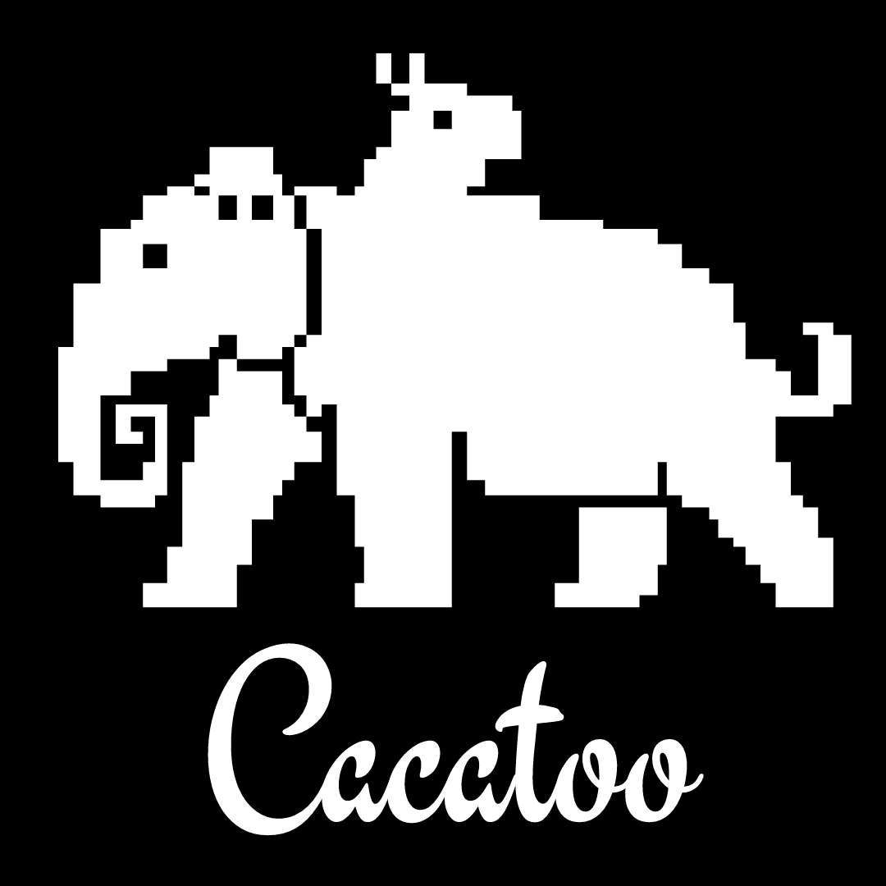

# Cacatoo

Cacatoo is a highly customisable toolkit for designing your own individual-based models. It is roughly based Cash (Cellular Automata Simulated Hardware, RJ de Boer & AD Staritsk), but because it is written in 100% javascript, it requires no installation and works on any machine. 

## Getting started

You don't need to install anything, just dowload this repository and start playing!
If you want help with Javascript / setting up a nice coding environment, check out this [blog post](https://www.bramvandijk.com/blog/2020/11/20/javascript-programming-part-ii-my-setup)
For Cacatoo-specific help, start by taking a look at the examples folder. This folder contains simple HTML files you can open with your browser (Chrome is recommended). Two examples (gol and cheater) have been extensively commented to explain how Cacatoo works.

## Notes for developers

The bundle was made with rollup:
> rollup src/model.js -o dist/cacatoo.js -f cjs  -w
(also see make_bundle.sh)

Documentation was compiled with jsdoc (npm install jsdoc -g)
> jsdoc dist/cacatoo.js

